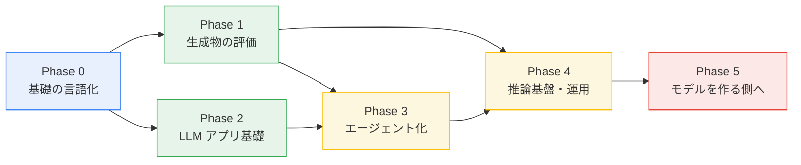

# AI 学習ロードマップ

`gekal-study-ai` Organization 全体の学習計画です。
個々のリポジトリは「試した記録」、このファイルは「どこへ向かうか」を管理します。

- 最終更新: 2026-08-02
- 見直しサイクル: 四半期ごと（[運用ルール](#運用ルール)を参照）

---

## 1. このロードマップの方針

3 つの原則で進めます。

1. **動くものを作ってから理論に戻る** — 既存リポジトリはすべて「まず Docker で動かす」から始まっている。この進め方を維持する。
2. **1 テーマ 1 リポジトリ** — リポジトリが成果物であり、進捗の単位でもある。
3. **完了条件を先に決める** — 各フェーズに「何ができたら次へ進むか」を明記する。学習が発散しないようにするため。

---

## 2. 現在地（2026-08 時点）

| リポジトリ | テーマ | 状態 | ここで得たもの |
| --- | --- | --- | --- |
| [`comfyui-vegetable-generator`](https://github.com/gekal-study-ai/comfyui-vegetable-generator) | 画像生成 / Text-to-Image | 稼働中 | ワークフロー API の構造、CPU 推論のステップ数と所要時間の関係、再現可能な実行環境の作り方 |
| [`codex-skills`](https://github.com/gekal-study-ai/codex-skills) | AI エージェント / Tool use | 稼働中 | 手順をスキルとして切り出す粒度の決め方、アイコン構成の監査の自動化 |
| [`dots-ocr-demo`](https://github.com/gekal-study-ai/dots-ocr-demo) | 文書理解 / VLM | 検証止まり | VLM 系 OCR の実行環境の立ち上げ |
| [`.github`](https://github.com/gekal-study-ai/.github) | ハブ / 公開 | 本リポジトリ | 全体像の管理と、静的サイトとしての公開 |

主な技術スタック: ComfyUI・Stable Diffusion 1.5・DOTS OCR・Docker Compose・Agent Skills・Next.js。

### 現状の強みと弱み

**強み**

- 推論環境を再現可能な形で組める。どのリポジトリも数コマンドで立ち上がり、依存はコンテナに閉じている。
- 制約を数値で残す習慣がある。Mac の Docker から GPU が使えないこと、CPU でのステップ数別の所要時間まで実測して記録している。

**弱み（= 次に埋める箇所）**

- **出力を評価できない。** 生成画像も OCR 結果も、良し悪しを判定する指標がどのリポジトリにもない。「動いた」で観測が止まっている。
- **推論しかしていない。** 学習・微調整・量子化といった、モデルの重みに触れる工程を通っていない。既存モデルの利用者の位置に留まっている。
- **LLM アプリの土台がない。** エージェントの入口（`codex-skills`）はあるが、その下にあるはずの構造化出力・埋め込み検索・コンテキスト設計を通っていない。
- 学習メモが理論の目次のみで、実装と結びついていない。

---

## 3. 全体像

| Phase | テーマ | 目安時期 | 新規リポジトリ |
| --- | --- | --- | --- |
| 0 | 基礎の言語化 | 2026 Q3 | なし（`.github` に集約） |
| 1 | 生成物の評価 | 2026 Q3–Q4 | `image-eval-lab` |
| 2 | LLM アプリ基礎 | 2026 Q4 | `rag-playground` |
| 3 | エージェント化 | 2027 Q1 | `mcp-servers` / `codex-skills` 拡張 |
| 4 | 推論基盤・運用 | 2027 Q1–Q2 | `inference-bench` |
| 5 | モデルを作る側へ | 2027 Q2 以降 | `finetune-lab` |

時期はあくまで目安です。完了条件を満たしたら次へ進みます。

---

## Phase 0 — 基礎の言語化

> 既に手を動かして知っていることを、説明できる形にする。

このフェーズだけは新しいものを作りません。既存 3 リポジトリで暗黙的に使った知識を明文化します。

### 学ぶこと

- Transformer の構造（Attention、位置エンコーディング、Encoder / Decoder の役割分担）
- Diffusion モデルの原理 — `comfyui-vegetable-generator` で毎回指定している `steps` / `cfg` / `sampler` が何をしているのか
- VLM の仕組み — `dots-ocr-demo` の OCR が「文字認識」ではなく「画像を条件にした生成」である点
- 評価指標の基礎（精度・再現率・F1、損失関数、交差検証）

### 成果物

- `.github/notes/` に学習ノートを追加
  - `transformer.md` — 図付きで自分の言葉で説明
  - `diffusion.md` — ステップ数・CFG スケールと実際の生成結果を並べた検証つき
  - `evaluation-basics.md` — 指標の使い分け
- 既存の [`profile/README.md`](profile/README.md) の技術領域マップから各ノートへリンク

### 完了条件

- [ ] `comfyui-vegetable-generator` の `workflows/api_vegetable.json` の各パラメータについて、なぜその値かを説明できる
- [ ] Attention の計算を数式ではなく図と言葉で説明したノートがある
- [ ] 分類タスクで「精度が高いのに使い物にならない」ケースを具体例で説明できる

---

## Phase 1 — 生成物の評価

> 「動いた」から「良し悪しを判定できる」へ。現状の最大の弱点を埋める。

### 学ぶこと

- 画像生成の定量評価（CLIP Score、美的スコア、参照画像との類似度）
- OCR の精度評価（文字誤り率 CER、レイアウト再現の評価）
- 人手評価の設計 — 評価基準の作り方、A/B 比較、評価者間の一致度
- 再現性の担保（seed 固定、パラメータのバージョン管理）

### 成果物

- **新規リポジトリ `image-eval-lab`**
  - `comfyui-vegetable-generator` の出力を入力として受け取り、スコア表を出す
  - パラメータを振った結果を比較表・グリッド画像として自動生成
- `dots-ocr-demo` の再開 — 正解データを用意して CER を測るところまで進める
- 各リポジトリの README に「評価結果」セクションを追加

### 完了条件

- [ ] 野菜画像の生成設定を 3 パターン以上比較し、数値と目視の両方で優劣を示した表がある
- [ ] `dots-ocr-demo` に 10 枚以上のテスト文書と、その CER 実測値がある
- [ ] 「seed とパラメータを指定すれば同じ画像が再現できる」ことがスクリプトで担保されている

---

## Phase 2 — LLM アプリ基礎

> エージェントを作る前に、その土台となる要素を単体で押さえる。

### 学ぶこと

- プロンプト設計とコンテキスト設計の違い — 何を渡すかの方が、どう書くかより効く
- 構造化出力（JSON Schema、Tool 定義による型の強制）
- 埋め込みとベクトル検索 — チャンク分割、検索の失敗パターン
- RAG の全体構成と、その評価（検索の再現率 / 生成の忠実性を分けて測る）
- LLM-as-a-Judge — 評価そのものを LLM に任せる際の落とし穴
- コストとレイテンシの見積もり、プロンプトキャッシュ

### 成果物

- **新規リポジトリ `rag-playground`**
  - 題材は `dots-ocr-demo` の OCR 結果 — 文書を読み取り、検索可能にし、質問に答えるまでを一本の線で繋ぐ
  - チャンク戦略を切り替えて、検索精度の差を測れる構成にする
- `notes/rag-failure-modes.md` — うまくいかなかったケースの記録（これが最も価値が高い）

### 完了条件

- [ ] OCR → チャンク分割 → 埋め込み → 検索 → 回答生成が 1 コマンドで通る
- [ ] 検索段階と生成段階のどちらが原因で誤答したか、切り分けられる仕組みがある
- [ ] チャンクサイズを 3 種類変えた場合の精度比較が記録されている

---

## Phase 3 — エージェント化

> `codex-skills` の延長線。単発の応答から、道具を使って多段で動く仕組みへ。

### 学ぶこと

- Tool use の設計 — ツールの粒度、説明文の書き方、失敗時の扱い
- MCP（Model Context Protocol）でのサーバー自作
- Skill / サブエージェントによる責務分割
- エージェントの評価 — 成功率、実行ステップ数、コスト
- 権限設計と安全側の設計（破壊的操作の確認、外部送信の扱い）

### 成果物

- **新規リポジトリ `mcp-servers`** — 自作 MCP サーバー（題材候補: 野菜画像生成の起動、文書検索、ローカルファイル横断検索）
- `codex-skills` の拡充 — Android アイコン以外に 2〜3 個のスキルを追加し、スキルの書き方の型を README にまとめる
- `notes/agent-design.md` — ツール分割の判断基準

### 完了条件

- [ ] 自作 MCP サーバーが Claude Code / Codex の両方から利用できている
- [ ] 「画像を生成し、評価し、基準を満たすまで再生成する」ループがエージェントとして動く
- [ ] スキルの成功率を 10 回試行で測り、失敗パターンを分類してある

---

## Phase 4 — 推論基盤・運用

> ローカルの Mac から出て、性能とコストを扱えるようにする。

### 学ぶこと

- 量子化（GGUF、AWQ、GPTQ）と精度・速度・メモリのトレードオフ
- 推論サーバー（vLLM、Ollama、llama.cpp）の使い分け
- GPU 環境 — クラウド GPU の調達、VRAM の見積もり、バッチ処理
- 監視とログ — トークン消費、レイテンシ分布、失敗率
- CI での評価自動化（GitHub Actions で回帰チェック）

### 成果物

- **新規リポジトリ `inference-bench`** — 同一モデルを構成違いで動かし、速度・メモリ・品質を並べたベンチマーク
- `comfyui-vegetable-generator` の GPU 対応（`docker-compose.nvidia.yml` を実際に動かすところまで）
- Organization 共通の GitHub Actions ワークフローを本リポジトリの `workflow-templates/` に配置

### 完了条件

- [ ] 同一タスクを CPU / GPU / 量子化ありなしで比較した実測表がある
- [ ] クラウド GPU 上で 1 つのワークロードを完走させ、費用を記録してある
- [ ] いずれかのリポジトリで、評価が CI により自動実行されている

---

## Phase 5 — モデルを作る側へ

> ここまでは既存モデルの利用者。ここからモデル自体に手を入れる。

### 学ぶこと

- LoRA / QLoRA によるファインチューニング
- データセット構築 — 収集、クリーニング、アノテーション、分割
- 学習の観測（損失曲線、過学習の検知、早期終了）
- 画像生成側の LoRA 学習と ControlNet
- 蒸留・小型化

### 成果物

- **新規リポジトリ `finetune-lab`**
  - 題材候補: 野菜 EC 画像のスタイルを固定する LoRA、または業務文書に特化した小型モデルの微調整
- `notes/dataset-building.md` — 実際に作ってわかったデータ整備の勘所

### 完了条件

- [ ] 自作データセットで LoRA を学習させ、ベースモデルとの差を Phase 1 の評価基盤で数値比較できている
- [ ] 学習が失敗した際に、データ・ハイパーパラメータ・実装のどこが原因か切り分けられる
- [ ] 学習コストと得られた改善量を対比して記録してある

---

## 4. 技術領域マップ

フェーズを横断する知識の地図です。詳細な分類は [`profile/README.md`](profile/README.md) を参照。

| 領域 | 現状 | 目標フェーズ |
| --- | --- | --- |
| 機械学習の理論 | 目次レベル | Phase 0 |
| 画像生成 | 実行できる | Phase 1（評価）→ Phase 5（学習） |
| 文書理解 / OCR | 起動しただけ | Phase 1 → Phase 2 |
| LLM アプリケーション | 未着手 | Phase 2 |
| エージェント / ツール連携 | スキル 1 個 | Phase 3 |
| 推論最適化・インフラ | Docker のみ | Phase 4 |
| 学習・ファインチューニング | 未着手 | Phase 5 |

---

## 5. 運用ルール

ロードマップを維持するための取り決めです。

### リポジトリを追加するとき

1. 命名は `<テーマ>-<形態>` に揃える（`-demo` = 動作確認、`-lab` = 実験、`-playground` = 試行、`-bench` = 計測）
2. README には最低限これを書く
   - 何を学ぶためのリポジトリか（1 行）
   - 動かし方（コマンドを 5 個以内に）
   - 制約と実測値（`comfyui-vegetable-generator` の性能表が良い手本）
   - わかったこと / わからなかったこと
3. 本ファイルの「現在地」表と、`profile/README.md` のリポジトリ一覧に追記する

### 判断を記録する

`comfyui-vegetable-generator/docs/decision-log.md` の形式を全リポジトリに広げます。
「なぜその構成にしなかったか」は時間が経つと必ず忘れるため、選ばなかった案も残します。

### 四半期ごとの見直し

各四半期末に本ファイルを更新します。

- 完了条件のチェックボックスを更新する
- 達成できなかった項目は、**期限を延ばすのではなく縮小するか削除する**
- 興味が変わったならフェーズごと差し替えてよい。計画に縛られること自体が目的ではない

### 学習ログ

`.github/notes/` に、日付つきで短く残します。長文にしない。
「試したこと / 結果 / 次にやること」の 3 行で十分です。

---

## 6. 参考文献

### 書籍

- ディープラーニング入門 — 松尾豊
- 統計的機械学習 — 津田宏治
- パターン認識と機械学習 — C.M. ビショップ

### モデル参照

- [ModelScope 魔搭社区](https://www.modelscope.cn/) — モデルの探索・入手

### フェーズ別に追加したい題材

| Phase | 題材 |
| --- | --- |
| 0 | The Illustrated Transformer / Diffusion モデルの解説記事 |
| 1 | CLIP Score・FID などの評価指標の原論文 |
| 2 | RAG の評価フレームワーク（Ragas 等）のドキュメント |
| 3 | MCP 公式仕様、Claude Agent SDK のドキュメント |
| 4 | vLLM・llama.cpp の設計ドキュメント |
| 5 | LoRA / QLoRA の原論文 |
